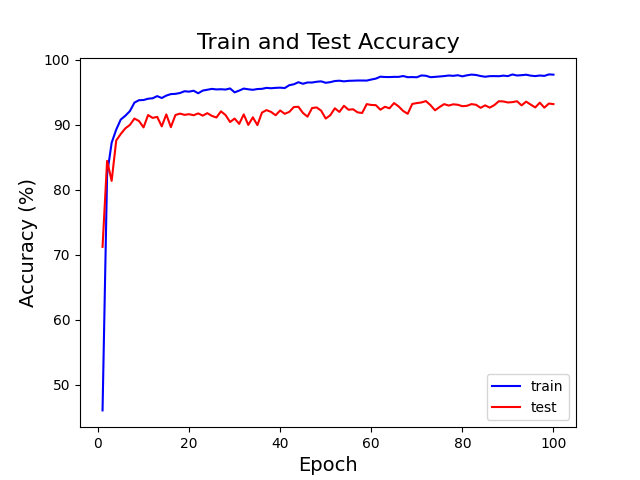

## Enviroment
1. The environment.yml file to activate env: `conda activate base` 

2. `Dataset` foler: 3 datasets, UCI, HAPT, and HHAR.

##  ============================self-supervised learning======================

### datasets
 [UCIHAR Dataset](https://archive.ics.uci.edu/ml/machine-learning-databases/00240/); 
 [HAPT dataset](https://archive.ics.uci.edu/ml/machine-learning-databases/00341/); 
 [HHAR dataset](https://archive.ics.uci.edu/ml/machine-learning-databases/00344/)

3 datasets are processed(the data processing files to be updated) and placed in `GitFYP_experiment/uci_data`, `GitFYP_experiment/hhar_data`, and `GitFYP_experiment/hapt_data`.

### training mode

Supervised: use "supervised" in the training mode.
Self-supervised training: use "ssl"
Fine-tuning: use "ft" in the training mode

### run the code 
In `GitFYP_experiment/ssl` folder: run the `main.py` file to excute the code. Other settings in the def get_args() function. 

##  =====================supervised learning=======================
1.  `GitFYP_experiment/pytorch_supervised` folder:
`mian_pytorch.py`: 
CNN-LSTM model: cd to `GitFYP_experiment` folder, run the `mian_pytorch.py` in `pytorch_supervised/HAPT`, `pytorch_supervised/HHAR`, and `pytorch_supervised/UCI` folder. 

CNN-LSTM-ATT model: in `Attention` folder.

`network.py`: used for the model network structure.

`data_preprocess.py`: used for data preprocession, data formatting, train and test loader, etc.

2. `result_supervised` folder: stored the confusion matrix, train&test accuracy, and f1 score files.

**Support Pytorch.**

## Prerequisites
- Python 3.x
- Numpy
- Pytorch 1.0+

There are many public datasets for human activity recognition. You can refer to this survey article [Deep learning for sensor-based activity recognition: a survey](https://arxiv.org/abs/1707.03502) to find more.

In this demo, we will use UCI and HAPT dataset as examples. 

# Appendix (to be updated)

## Usage
Go to `HAR-CNN-LSTM` folder, config the folder of your data in `config.py`, and then run `main_pytorch.py`.

## Network structure
What is the most influential deep structure? CNN/RNN it is. So we'll use **CNN-LSTM** in our demo. 

## CNN-lstm structure
Convolution + pooling + convolution + pooling + lstm + dense + output

That is: 2 convolutions, 2 poolings, 1 lstm, and 1 fully connected layers. 

## About the inputs
Regarding UCI dataset, it contains 9 channels of the inputs: (acc_body, acc_total and acc_gyro) on x-y-z. So the input channel is 9.

Regarding HAPT dataset, it contains 1 inputswith 561 features. I split them into 3 x 187. So the input channel is 3.

**CNN-LSTM** archetechture achived 95% accuracy in both dataset.

CNN-LSTM with UCI dataset:

CNN-LSTM with HAPT dataset:

## A CNN-LSTM Approach to Human Activity Recognition in pyTorch with UCI and HAPT dataset

> Deep learning is perhaps the nearest future of human activity recognition. While there are many existing non-deep method, we still want to unleash the full power of deep learning. This repo provides a demo of using deep learning to perform human activity recognition.

In github, there is no repo using **pyTorch nn** with **conv1d and lstm** with UCI and HAPT dataset. 

Since time series data is in 1 dimension, I amended JinDong's network file from conv2d into conv1d. 

## Paper and reference
Architecture of CNN-LSTM networks refers to paper: [Hybrid Model Featuring CNN and LSTM Architecture for Human Activity Recognition on Smartphone Sensor Data](https://ieeexplore.ieee.org/document/9029136) by Samundra Deep and Xi Zheng ; [A CNN-LSTM Approach to Human Activity Recognition](https://ieeexplore.ieee.org/document/9065078) by Ronald Mutegeki and Dong Seog Han.

Network Python code is implemented with reference by [Deep-learning-activity-recognition](https://github.com/jindongwang/Deep-learning-activity-recognition.git) by JinDong Wang.

## Future work

